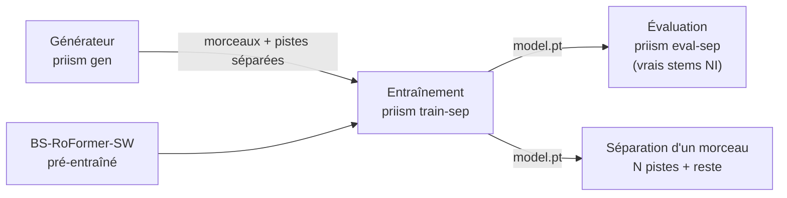
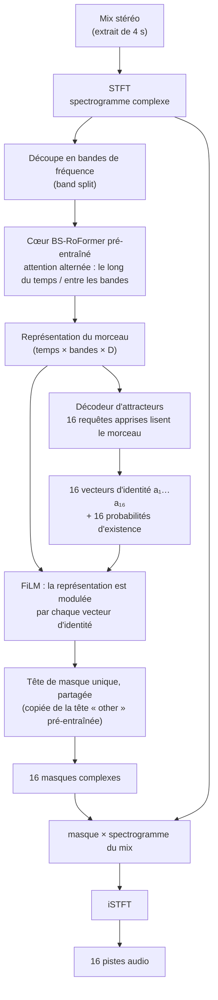
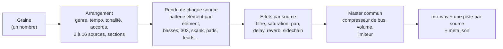
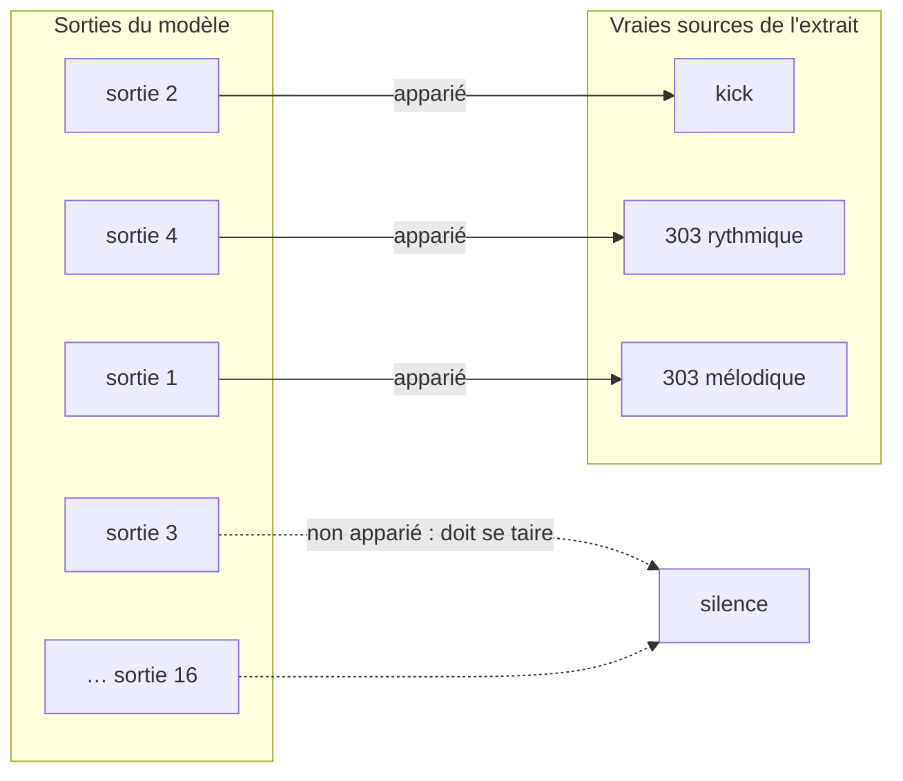
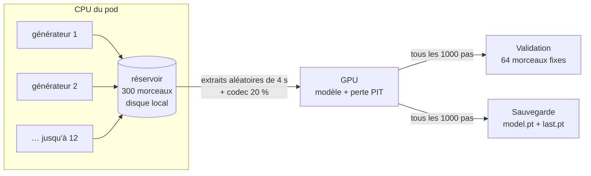
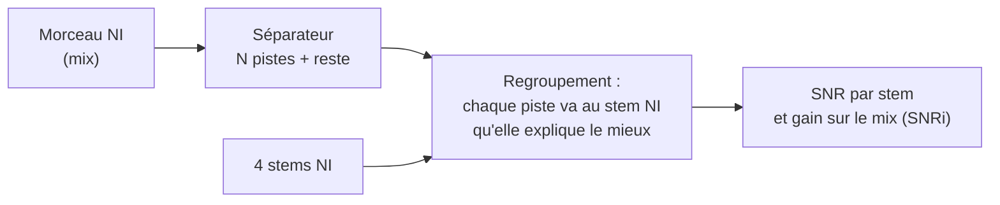

# Le modèle Priism

*Ce que fait le code sur `main` au 8 octobre 2026 (commit `d23dcd0`). Pour le raisonnement derrière ces choix,
voir la note de conception `architecture-identite.md`.*

---

## En bref

- **Le but** : donner un morceau mixé et récupérer **une piste par source** (kick, hats, basse, chaque synthé…),
  sans liste d'instruments fixée à l'avance. Deux 303 qui jouent en même temps donnent deux pistes.
- **Le modèle** : un *séparateur à attracteurs*. On garde le cœur d'un modèle de séparation déjà entraîné
  (**BS-RoFormer-SW**), on remplace ses sorties fixes (une par stem : drums, bass, other…) par **16 « emplacements »**
  que le modèle remplit lui-même, et il dit pour chacun si une source s'y trouve vraiment.
- **L'entraînement** : sur des **morceaux synthétiques** générés à la volée (`priism gen`), dont on connaît
  chaque piste. Les pistes ne portent pas de nom pour le modèle : on cherche juste le meilleur appariement entre
  ses sorties et les vraies pistes (*entraînement invariant par permutation*, PIT).
- **L'évaluation** : sur de vrais morceaux avec stems (65 NI Free Stems).

---

## 1. L'architecture

Le code : `src/priism/model/msst_core.py` (version réelle, sur le cœur pré-entraîné) et
`src/priism/model/separator.py` (même idée en petit, pour tester sur CPU).

Les pièces, une par une :

| Pièce | Rôle | Détail dans le code |
|---|---|---|
| **Cœur BS-RoFormer-SW** | Comprendre le son musical. Il a déjà appris sur de vrais morceaux à séparer des stems fixes ; on garde tout ce savoir. | Chargé depuis le checkpoint MSST (`load_msst_roformer`). On réutilise ses étapes jusqu'à `final_norm`. |
| **Décodeur d'attracteurs** | « Combien de sources, et lesquelles ? » 16 requêtes apprises interrogent la représentation du morceau (comme DETR en vision) et deviennent 16 vecteurs d'identité. | `AttractorDecoder` : 2 couches de Transformer décodeur. Pour rester léger, il lit un résumé par trame et un résumé par bande, pas toute la grille. |
| **Probabilité d'existence** | Pour chaque vecteur, « y a-t-il vraiment une source ici ? ». C'est ce qui fait **compter** les sources au modèle. | Une couche linéaire → logit. Seuil 0,5 à l'inférence. |
| **FiLM** | Dire à la tête *quelle* source extraire : la représentation est multipliée et décalée en fonction du vecteur d'identité. | Initialisé presque à zéro : au départ, les 16 emplacements se comportent tous comme la tête « other » pré-entraînée, puis ils se spécialisent. |
| **Tête de masque** | Produire un masque complexe stéréo par source, appliqué au spectrogramme du mix. | Une seule tête pour les 16 emplacements (copie de `mask_estimators[2]`, « other »). Les têtes d'origine sont supprimées. |
| **Le « reste »** | Ce que les pistes gardées n'expliquent pas. | `reste = mix − somme des pistes gardées` : la somme des pistes redonne **exactement** le mix. |

**Pourquoi des masques ?** Le modèle ne fabrique pas de son : il dit, pour chaque point temps-fréquence du mix,
quelle part revient à chaque source. Le résultat reste donc fidèle au morceau d'origine (pas d'hallucination
comme avec un modèle génératif).

**Mémoire GPU.** Le cœur est gros : le code recalcule les activations pendant la rétropropagation
(*gradient checkpointing*) et calcule en bfloat16, pour tenir dans 24 Go avec des extraits de 4 s et 2 extraits
par lot.

---

## 2. Les données d'entraînement : le générateur

Le code : `src/priism/gen/` (`song.py`, `genres.py`, `drums.py`, `tonal.py`, `fx.py`, `augment.py`).
Spécification complète : `spec-generateur-v2.md`.

Il n'existe pas de grande base de morceaux électroniques avec une piste par instrument. Le générateur en
fabrique, avec la vérité terrain gratuite : il sait ce qu'il a joué.

Ce qui compte pour le modèle :

- **11 genres** : techno, acid, dub techno, minimal, house, electro, breakbeat, dnb, dub, steppers, dubstep.
  Chacun donne un tempo, un groove et des instruments probables, pas une liste fixe.
- **Nombre de sources tiré uniformément entre 2 et 16**, pour que le modèle apprenne à compter et ne
  s'habitue pas à « environ 6 ».
- **Granularité fine** : kick, snare, hats, etc. sont des pistes séparées. Les effets (delay, reverb) restent
  **dans la piste de leur instrument** (décision de Lucas).
- **Cas difficiles volontaires** :
  - *jumeaux* (30 % des morceaux) : le même instrument joue deux parties différentes (ex. une 303 rythmique
    et une 303 mélodique avec le même son). Ce sont deux pistes à séparer ;
  - *paires ambiguës* (6 %) : même son, même registre, notes imbriquées. Même une oreille ne peut pas
    trancher, donc ces deux pistes sont **fusionnées en une seule cible** (`merge_group`) : le modèle n'est
    pas puni s'il n'en fait qu'une.
- **Master réaliste mais additif** : le compresseur et le limiteur calculent une courbe de gain sur le mix,
  appliquée à l'identique à chaque piste. Le mix reste exactement la somme des pistes.
- **Dégradation codec** : 20 % des mix d'entraînement passent par un MP3, AAC ou Opus (96 à 320 kb/s),
  comme les morceaux réels qu'un DJ récupère. Les cibles restent propres.

---

## 3. Comment il apprend : la perte PIT

Le code : `src/priism/model/loss.py`.

Le modèle sort 16 pistes sans nom ; un extrait contient N vraies sources (N ≤ 16). On ne peut pas dire
« la sortie 3 doit être le kick ». On cherche donc **le meilleur appariement** sorties ↔ sources
(algorithme hongrois, sur le SNR), puis on corrige le modèle selon cet appariement.

La perte totale additionne quatre termes :

| Terme | Ce qu'il demande | Poids |
|---|---|---|
| **Séparation** | Chaque sortie appariée doit ressembler à sa source (−SNR, plafonné à 30 dB pour que les sources faciles ne dominent pas). | 1 |
| **Existence** | Les sorties appariées doivent dire « j'existe », les autres « je n'existe pas » (entropie croisée binaire). C'est là qu'il apprend à compter. | 1 |
| **Silence** | Les sorties non appariées doivent être muettes (énergie relative au mix). | 0,1 |
| **Reconstruction** | La somme des 16 sorties doit redonner le mix. | 0,5 |

Une source inaudible dans l'extrait (plus de 50 dB sous le mix) ne compte pas comme présente.

---

## 4. La boucle d'entraînement

Le code : `src/priism/model/train.py` et `src/priism/model/stream.py`. Jobs du pod : `pod/jobs/`.

Les morceaux d'entraînement **ne sont pas stockés** : pendant que le GPU entraîne, plusieurs processus CPU
génèrent des morceaux de 30 s dans un réservoir tournant (300 morceaux ; les plus vieux sont effacés). Le
modèle lit des extraits aléatoires de ce réservoir. Il ne voit donc jamais deux fois le même jeu de morceaux.

Réglages du run long (`pod/jobs/0310-attr-train.sh`) :

| Réglage | Valeur | Pourquoi |
|---|---|---|
| Pas d'entraînement | 40 000 | |
| Lot | 2 extraits de 4 s | limite de mémoire sur 24 Go |
| Learning rate | 3e-4 pour les parties neuves (attracteurs, FiLM, tête), **3e-5 pour le cœur** | les parties neuves doivent bouger vite, le cœur ne doit pas oublier ce qu'il sait |
| Optimiseur | AdamW, *one-cycle* (montée sur 5 % des pas puis descente), gradients écrêtés à 5 | |
| Validation | 64 morceaux synthétiques fixes (graines 900 000 000…), un extrait chacun | mesure : SNR des sources, justesse du comptage |
| Reprise | automatique depuis `last.pt` | un pod peut être arrêté à tout moment |

Avant ce run, `0300-attr-check.sh` fait 500 pas pour vérifier que tout tient en mémoire et commence à
apprendre.

---

## 5. L'évaluation sur du vrai son

Le code : `src/priism/model/evaluate.py` (commande `priism eval-sep`).

Le synthétique ne suffit pas : ce qui compte, c'est le vrai son. On teste sur les **65 NI Free Stems**
(`testset/ni-free-stems`), de vrais morceaux livrés en 4 stems (ex. Drums / Bass / Synths / Vocals).

Problème : le modèle découpe **plus fin** que ces 4 stems (il sort kick, hats, snare… là où NI n'a que
« Drums »). On regroupe donc d'abord ses pistes : chaque piste va au stem qu'elle explique le mieux.

**SNRi** = combien de dB on gagne par rapport à « rendre le mix tel quel » pour chaque stem. Ce regroupement
triche un peu (il regarde la réponse), donc même un modèle non entraîné obtient un SNRi positif : on compare
les runs entre eux et au modèle du pas 0, pas à zéro.

---

## 6. À l'inférence

`model.separate(mix)` : le modèle sort ses 16 emplacements, on garde ceux dont la probabilité d'existence
dépasse 0,5, et on ajoute le **reste** (mix − somme). Résultat : N pistes non nommées + 1 piste « reste »,
qui se ressomment exactement en le mix.

---

## 7. Ce qui est prévu mais pas encore codé

La note de conception propose aussi ces éléments, **absents du code actuel** :

- **Morceaux entiers en deux passes** : aujourd'hui le modèle traite un extrait à la fois, et rien ne garantit
  que « piste 3 » soit la même source d'un extrait à l'autre. Prévu : une première passe qui regroupe les
  vecteurs d'identité sur tout le morceau, puis une séparation avec ces identités fixées.
- **MixIT sur du vrai son sans stems** : apprendre aussi sur de vrais morceaux (FMA, déjà téléchargeable via
  `priism fma`) en additionnant deux morceaux et en demandant au modèle de les redécouper.
- **Perte de *deep clustering*** auxiliaire, pour que des sources qui se ressemblent aient des vecteurs
  d'identité proches (utile pour fusionner des pistes à la demande).
- **Vraies données avec stems** (MUSDB18-HQ, MoisesDB) dans l'entraînement.
- **Noms des pistes** : un classificateur séparé, après la séparation, qui propose « kick », « 303 »…
  Indépendant du séparateur.

---

## Annexe : historique

La première tentative (dossier `pod/jobs-v1/`, `docs/modular-training.md`) affinait BS-RoFormer-SW pour 4 stems
fixes (drums / bass / acid / rest) sur des lignes de 303 synthétiques. Elle a montré que le cœur s'adapte bien
(SDR acid de 4,9 à 8,5 dB en une époque) mais oublie un peu ailleurs (batterie −2 dB), d'où le *learning rate*
réduit du cœur aujourd'hui. Cette approche par classes fixes a été abandonnée le 7 octobre au profit de la
séparation par identité décrite ici.

## Où lire le code

| Sujet | Fichier |
|---|---|
| Modèle sur cœur pré-entraîné | `src/priism/model/msst_core.py` |
| Décodeur d'attracteurs, petit modèle CPU | `src/priism/model/separator.py` |
| Perte PIT | `src/priism/model/loss.py` |
| Extraits d'entraînement | `src/priism/model/data.py` |
| Génération pendant l'entraînement | `src/priism/model/stream.py` |
| Boucle d'entraînement | `src/priism/model/train.py` |
| Évaluation sur stems NI | `src/priism/model/evaluate.py` |
| Générateur de morceaux | `src/priism/gen/` |
| Jobs GPU | `pod/jobs/0300-attr-check.sh`, `pod/jobs/0310-attr-train.sh` |
