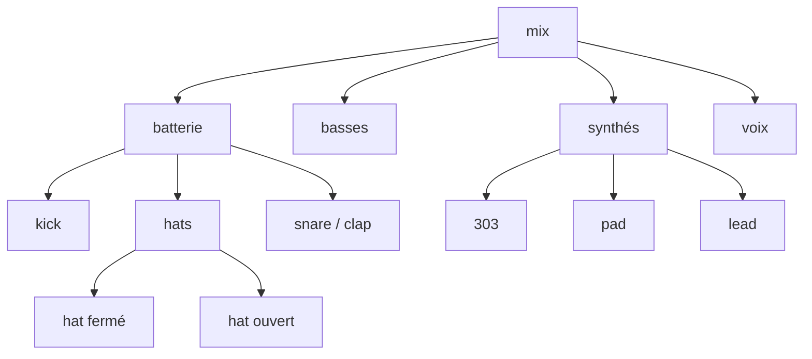
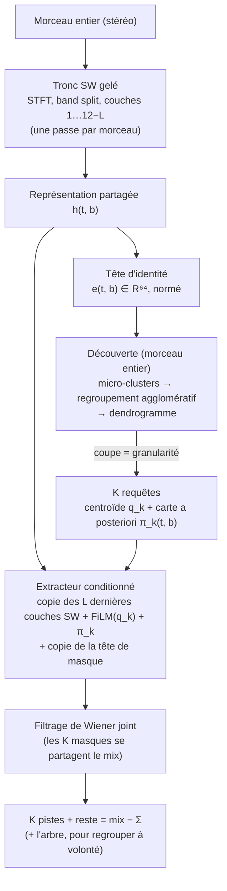

# Plan v2 : découvrir puis extraire

*Note de conception, 9 octobre 2026. Elle remplace la file « jumeaux » et le séparateur à 16 emplacements
(docs/modele.md) comme direction principale. Rien n'est encore codé ; chaque phase a un critère de passage
mesuré sur de la vraie musique.*

---

## 0. En bref

1. **Le problème n'est pas le mécanisme, c'est le domaine.** Sur les stems NI, BS-Roformer-SW tel quel gagne
   +8,1 dB par stem ; après notre fine-tune sur morceaux synthétiques, +2,5 dB. Tant que le modèle perd
   5,6 dB sur du vrai son, optimiser les jumeaux sur une validation synthétique ne sert à rien.
2. **Séparer « quelles sources existent » de « extraire cette source ».** La découverte se fait sur le
   **morceau entier**, en regroupant des vecteurs d'identité produits par le tronc pré-entraîné. Le
   regroupement donne un **arbre** (batterie → kick, hats… ; synthés → lead, pad…). L'extraction est un
   petit réseau conditionné par une requête, qui sort une source ou un groupe entier selon la requête.
   Le nombre de pistes devient un réglage (coupe de l'arbre), pas une sortie fragile du réseau.
3. **Réutiliser au maximum, entraîner peu.** Le tronc SW reste gelé et partagé, et seules ses 2 à 4
   dernières couches sont recopiées et conditionnées. La tête de masque est recopiée elle aussi. On entraîne
   donc quelques dizaines de millions de paramètres au plus. Une **perte d'ancrage** impose qu'une requête
   « groupe batterie » redonne la batterie de SW : on ne peut pas tomber sous SW au niveau grossier.
4. **Une seule perte pour toutes les granularités de vérité.** Synthétique (fin), MoisesDB / MedleyDB /
   Slakh (instrument), MUSDB / NI (4 stems), pseudo-stems d'un enseignant (mixte) et MixIT (2 mélanges) sont
   tous des **arbres partiels**. La perte ne contraint que ce que la vérité sait.
5. **Données : arrangement synthétique, timbres réels.** Le générateur garde son moteur d'arrangement mais
   joue de vrais échantillons, des synthés VST et de vrais stems et boucles. MixIT pur est écarté comme
   signal principal ; il reste un cas particulier gratuit de la perte (section 6).
6. **Coût visé : 150 à 250 h de GPU au total** (RTX 4090 ou L40S), soit 60 à 200 $, réparties en
   5 phases. Chaque phase a un critère de passage sur de la vraie musique.

---

## 1. Diagnostic de l'existant

Ce que le repo a appris (chiffres tirés des commits et des commentaires des jobs) :

| Constat | Chiffre | Conséquence |
|---|---|---|
| Le fine-tune synthétique fait oublier le vrai son | NI groupé : SW **+8,1 dB**, stage B **+2,5 dB** | l'écart de domaine domine tout le reste |
| La séparation plafonne sur 2 à 16 sources | ~2,6 dB (0312), 8,9 dB en validation synthétique (stage D) | le modèle apprend le générateur |
| Les requêtes fixes se spécialisent par type | kick dans l'emplacement 9 pour 93 % des morceaux, ~7 emplacements sur 16 jamais utilisés | DETR rejoue des classes fixes déguisées |
| Les jumeaux restent fusionnés malgré 6 mécanismes | 1,9 à 3 dB ; v2 −0,09 dB ; facteurs +0,23 dB ; tête de notes top-1 à 0,08 | problème mal posé, attaqué trop tôt |
| L'attention par slots casse l'acquis | v3 à froid : 8,9 → −0,8 dB au pas 0, 0,5 dB au pas 1000 | chaque mécanisme neuf repart de loin |
| Mémoire | 2 extraits × 16 emplacements × carte pleine résolution → lot de 2 | entraînement lent et bruité |
| Pas de cohérence sur un morceau entier | l'emplacement 3 n'est pas la même source d'un extrait à l'autre ; `split.py` recolle a posteriori | défaut structurel |

Ce qui rend le projet brouillon tient moins au code qu'à la **méthode** :
- les décisions se prennent sur des sondes de 1000 pas, avec des seuils de ±0,3 dB, sur une validation
  **synthétique** ;
- chaque idée devient un drapeau de plus (v1/v2/v3, facteurs, JEPA, mix-pitch, warm/cold…), sans qu'aucune ne
  s'attaque à l'écart de 5,6 dB ;
- il n'y a pas de banc d'essai réel **fin** (instrument par instrument) qui serve de boussole. NI ne compte
  que 4 groupes, et le regroupement par oracle y est indulgent.

Ce qu'on garde : le générateur et son moteur d'arrangement, le mastering additif, le flux de morceaux
(`stream.py`), l'enseignant SW (`distill.py`), `eval_stems.py`, `listen`, `tempo_key.py`, l'outillage du pod
(file de jobs, garde, sondes).

---

## 2. Reformuler le problème

### 2.1 Une « source » est un nœud d'arbre, pas une étiquette

« Une piste par instrument » n'a pas de définition unique. Un kick fait de deux couches, c'est une source ou
deux ? Et deux lignes de hats ? Une 303 et son delay ? La vérité dépend du producteur : MUSDB s'arrête à
4 stems, MoisesDB à environ 11 catégories puis l'instrument, notre générateur descend à l'élément de batterie.
La structure naturelle est un **arbre** :

Conséquences :
- **la sortie du système est un arbre**. Le DJ choisit sa profondeur : 4 pistes pour Mixxx, 12 pour un
  remix ;
- **chaque jeu de données donne un arbre partiel**. MUSDB connaît 4 feuilles, sans rien en dessous ; le
  synthétique connaît tout. La perte ne doit punir que ce que la vérité affirme ;
- **les jumeaux identiques** (même timbre, parties entrelacées) sont une feuille qu'on ne descend qu'à la
  demande (phase 5), pas un objectif de base.

### 2.2 Ce qu'on mesure

Deux défauts opposés existent : **sur-séparer** (une source coupée en trois) et **sous-séparer** (trois
sources dans une piste). Un seul SNR ne les distingue pas. Pour chaque niveau d'arbre où une vérité existe,
on mesure donc :

| Mesure | Définition | Défaut qu'elle voit |
|---|---|---|
| **SNR strict** | appariement 1-1 (hongrois) sorties ↔ références | sous-séparation |
| **SNR groupé** | partition optimale des sorties en références (déjà dans `eval_stems.py`) | qualité du son, indulgent |
| **Pureté** | part de l'énergie de chaque sortie qui vient de sa référence majoritaire (pondéré énergie) | sous-séparation |
| **Complétude** | part de l'énergie de chaque référence qui tombe dans sa sortie majoritaire | sur-séparation |
| **Erreur de comptage** | \|N̂ − N\| au niveau considéré | les deux |

La pureté et la complétude se calculent dans le domaine STFT : la contribution de la référence j à la
sortie k vaut Σ_tf |Ŝ_k| · m_j, où m_j = |S_j|² / Σ_i |S_i|². Le calcul est bon marché et ne demande aucun
appariement.

---

## 3. Architecture : découvrir puis extraire

### 3.1 Tronc partagé (pré-entraîné, gelé)

On garde les étapes de BS-Roformer-SW jusqu'à la couche 12−L (L = 2 à 4) : STFT, band split, puis les blocs
d'attention alternée temps / bandes. On réutilise `MsstAttractorSeparator._features` tel quel. Le tronc
tourne **une fois par extrait**, sans gradient, en bf16, et toutes les requêtes le partagent. C'est ce qui
rend l'entraînement bon marché : la partie lourde ne garde aucune activation.

Si la phase 1 montre que les représentations gelées ne distinguent pas deux synthés rangés dans « other »,
on ajoute un LoRA (r = 16) sur les couches du tronc. On ne fait jamais de fine-tune complet : c'est lui qui a
fait perdre les 5,6 dB.

### 3.2 Tête d'identité

C'est un MLP sur h, qui lit éventuellement aussi une couche intermédiaire, moins spécialisée, pour sortir
e(t, b) ∈ R⁶⁴ normé. Elle compte environ 0,5 M de paramètres. Chaque jeton bande × trame reçoit un vecteur.
Deux jetons dominés par la même source doivent avoir des vecteurs proches, **même s'ils viennent de deux
moments éloignés du morceau** (même lead, notes différentes, filtre ouvert puis fermé).

C'est l'idée du *deep clustering* (Hershey 2016) et du *deep attractor network* (Chen 2017), avec trois
différences :
- elle porte sur les jetons d'un tronc pré-entraîné, pas sur des bins STFT bruts ;
- elle est entraînée **entre deux extraits du même morceau**, pour imposer la cohérence à l'échelle du
  morceau ;
- elle est entraînée avec des **labels partiels hiérarchiques** (section 4.1).

### 3.3 Découverte au niveau du morceau

Ce n'est pas un réseau mais un algorithme, sans paramètre appris.
1. On tire environ 50 000 jetons du morceau, pondérés par leur énergie (un jeton silencieux ne vote pas).
2. Un k-means à 256 micro-clusters, puis un regroupement agglomératif (lien moyen, cosinus) sur les
   centroïdes, donnent un **dendrogramme**.
3. On coupe le dendrogramme à un seuil calibré sur la validation (MoisesDB + synthétique), ou à un nombre de
   pistes demandé (`--tracks 4` pour Mixxx), ou selon un curseur de granularité.
4. Chaque cluster k donne un centroïde q_k et une carte a posteriori π_k(t, b) = softmax_j(⟨e, q_j⟩/τ). La
   carte dit **où** k domine, relativement aux autres sources.

Ce qu'on gagne par rapport aux 16 emplacements :
- **compter** devient une coupe d'arbre, réglable, au lieu d'un seuil sur 16 logits appris sur extraits de 4 s ;
- **la cohérence sur le morceau** est acquise par construction : une requête est valable de la première à la
  dernière seconde, et le recollage de `split.py` disparaît ;
- **la hiérarchie** est gratuite : le dendrogramme est l'arbre de la section 2.1 ;
- aucun emplacement n'est lié à un type, puisqu'il n'y a plus d'emplacement.

### 3.4 Extracteur conditionné par requête

Pour chaque requête k, l'extracteur procède ainsi :
1. FiLM(h ; q_k), puis on ajoute une projection de [π_k, ⟨e, q_k⟩] : une carte « où » et une carte « quoi » ;
2. il passe dans les **L dernières couches de SW, recopiées** et précédées chacune d'un FiLM initialisé à
   l'identité ;
3. il passe dans la **tête de masque de SW, recopiée**, qui sort un masque complexe stéréo.

À l'initialisation, l'extracteur reproduit exactement SW ; il apprend seulement à se laisser orienter par la
requête. Le principe est celui de Banquet (Watcharasupat et Lerch, ISMIR 2024 : un seul décodeur pour tous
les stems, conditionné par une requête), à une différence près : **la requête vient du mix lui-même** (un
cluster), pas d'un enregistrement de référence fourni par l'utilisateur.

La même requête peut désigner **une source ou un groupe**. Un nœud haut du dendrogramme, par exemple « toute
la batterie », a son propre centroïde et sa propre carte (la somme des π de ses membres). Un seul extracteur
sert donc toutes les granularités, et l'export 4 pistes pour Mixxx n'est qu'une coupe de l'arbre.

### 3.5 Assemblage

Un filtrage de Wiener joint répartit le mix entre les K masques et un masque « reste » : un même son ne
peut pas apparaître deux fois. Le reste vaut mix − Σ pistes, si bien que la somme redonne exactement le mix,
comme aujourd'hui.

### 3.6 Coût de calcul

| | Aujourd'hui (16 emplacements) | Plan v2 |
|---|---|---|
| Passes de tronc par extrait | 1, avec gradient | 1, sans gradient |
| Réseau par source | tête complète × 16, toujours | L couches + tête × Q requêtes tirées (Q = 4) |
| Paramètres entraînés | tronc + décodeur + têtes | tête d'identité + L couches (ou LoRA) + tête de masque |
| Lot réaliste sur 24 Go | 2 extraits de 4 s | 8 extraits de 6 s × 4 requêtes (à vérifier en phase 2) |
| Inférence, 12 pistes | 1 passe | ≈ 3 à 4 passes SW équivalentes (tronc une fois, puis 12 × L/12 du tronc + tête) |

---

## 4. Pertes

### 4.1 Identité : affinité hiérarchique à labels partiels

On tire M ≈ 2048 jetons sur **deux extraits du même morceau**, pondérés par énergie. Pour chaque paire
(i, j), une cible d'affinité découle de la vérité disponible :

| Les jetons i et j sont dominés par… | Cible | Exemple |
|---|---|---|
| la même feuille connue | 1 | deux jetons du même hat (synthétique) |
| deux feuilles différentes | 0 | kick contre pad |
| la même feuille **grossière** dont on ignore l'intérieur | **ignorée** | deux jetons de « other » dans MUSDB |
| (option) deux feuilles sœurs dans l'arbre | α ≈ 0,3 | kick contre hat, tous deux batterie |

La perte est une BCE entre la cible et le cosinus mis à l'échelle, pondérée par le produit des énergies et
par la dominance (un jeton à 50/50 compte peu). Avec M = 2048, cela fait 4 M de paires par extrait :
négligeable.

L'option α rend le dendrogramme musical : la batterie se regroupe avant de rejoindre les synthés. Ce n'est
pas un classifieur, aucun nom n'est appris, et la règle « pas de spécialisation par type » est respectée.

### 4.2 Extraction

On tire jusqu'à Q = 4 requêtes par extrait, parmi :
- **une source présente** : la requête est le prototype oracle de la source, c'est-à-dire la moyenne des e
  pondérée par sa dominance, calculée **sur un autre extrait du même morceau**, avec du bruit (jetons
  retirés, mélange léger avec un prototype voisin) pour imiter les erreurs de découverte. La cible est la
  source ;
- **un groupe** (sous-arbre, ou feuille grossière dans MUSDB) : la requête est le prototype du groupe, la
  cible la somme de ses membres ;
- **une source absente de l'extrait mais présente ailleurs dans le morceau** (un break) : la cible est le
  silence. Le modèle apprend ainsi à se taire quand on lui demande une source qui ne joue pas.

La perte est −SNR, plafonné comme aujourd'hui, plus une perte STFT multi-résolution légère. La carte π est
calculée avec les prototypes de toutes les sources de l'extrait, comme à l'inférence.

### 4.3 Ancrage (distillation de SW)

Sur de vrais morceaux sans stems, l'enseignant SW sort ses 6 stems. Des requêtes de groupe en sont tirées
(prototype pondéré par la dominance de chaque stem de l'enseignant), et la cible est le stem de l'enseignant.
L'extracteur ne peut donc pas descendre sous SW au niveau grossier, ce qui règle l'oubli de 5,6 dB. Le
code de `distill.py` sert tel quel.

On ajoute le même ancrage avec un modèle DrumSep sur la batterie de SW (kick, snare, toms, hats, cymbales)
quand un tel modèle est disponible.

### 4.4 Le cas MixIT, en une ligne

MixIT, c'est la perte 4.2 avec deux feuilles grossières (mélange A, mélange B) et des requêtes de groupe. Il
ne demande donc aucun code à part. Son intérêt est discuté en section 6.

---

## 5. Données

### 5.1 Quatre sources de vérité, une seule perte

| Niveau | Jeux | Vérité | Rôle |
|---|---|---|---|
| **A. Réel fin** | MoisesDB (train), MedleyDB, Slakh2100 | instrument par instrument (arbre à 2 niveaux) | timbres réels, la vérité la plus précieuse |
| **B. Générateur v3** | `priism gen`, réaliste (5.2) | arbre complet | électronique, granularité fine, cas difficiles |
| **C. Réel grossier** | MUSDB18-HQ train | 4 feuilles | voix, instruments acoustiques |
| **D. Réel sans stems** | bibliothèque de Lucas, FMA électronique | pseudo-arbre de l'enseignant (SW + DrumSep) | **domaine cible**, ancrage |

Mélange de départ, par pas : 30 % A, 30 % B, 25 % D, 15 % C. On l'ajuste ensuite selon le banc d'essai réel,
jamais selon la validation synthétique. Règle : **au moins la moitié des pas sur du son réel**.

### 5.2 Générateur v3 : arrangement synthétique, timbres réels

Le moteur d'arrangement (genres, tempo, harmonie, sections, 2 à 16 sources) et le mastering additif restent.
On change ce qui sonne :

| Aujourd'hui | Plan v3 |
|---|---|
| Batterie synthétisée (balayages sinus, bruit filtré) | **Sampler** : vrais one-shots (909, 808, packs sous licence libre), mêmes motifs, vélocité, accordage, enveloppe, couches. Une boîte à rythmes *est* un sampler : c'est ainsi que la musique électronique est faite |
| Synthé maison + Surge XT | Surge XT + autres synthés libres rendus par DawDreamer (Vital, Dexed, OB-Xd, Odin 2), à valider en headless |
| Rien de réel | **Vrais stems et boucles** comme sources : stems MoisesDB, MedleyDB et Slakh, boucles FSL10K, recalés au tempo et à la tonalité du morceau (`tempo_key.py`) |
| Pas de voix | Voix et *vocal chops* découpées dans les stems de voix réels (MUSDB, MoisesDB) |

Le générateur garde sa garantie : la somme des pistes vaut exactement le mix, la vérité est complète, et tout
se régénère depuis la graine.

### 5.3 Évaluation : jamais entraînée, toujours réelle

| Jeu | Granularité | Ce qu'il mesure |
|---|---|---|
| **MoisesDB test** (~40 morceaux réservés) | instrument | **boussole principale** : la séparation fine sur du vrai son |
| **NI Free Stems** (65) | 4 groupes, électronique | le domaine cible au niveau grossier |
| MUSDB18-HQ test (50) | 4 stems | comparaison avec la littérature |
| Validation synthétique fixe (64) | arbre complet | diagnostic seulement, jamais critère de décision |
| *Option :* 10 à 20 morceaux électroniques avec stems par instrument | instrument, électronique | le vrai juge (stems de concours de remix, projets d'amis producteurs) |

---

## 6. Verdicts sur les stratégies d'entraînement

### MixIT : pas comme signal principal

- **Le raccourci.** Deux morceaux réels additionnés se séparent par ce qui les distingue globalement
  (tempo, tonalité, style, mixage), pas par instrument. `tempo_key.py` réduit le raccourci, sans le
  supprimer : il reste le style, la densité et le mastering.
- **Aucune pression vers le fin.** MixIT demande seulement que les sorties se regroupent en A et B. Rien
  n'oblige à séparer le kick des hats *à l'intérieur* de A. La granularité obtenue est arbitraire :
  c'est le problème de sur- et sous-séparation connu de MixIT.
- **Mélange irréaliste.** Deux morceaux complets, c'est deux fois la densité d'un vrai morceau, avec des
  sources désynchronisées. Or la difficulté réelle, ce sont des sources **synchrones** et **en harmonie** :
  kick et basse calés, sidechain.

Ce qu'on en garde : une variante ciblée, **MixIT à l'intérieur d'un stem**. On prend les stems « other » de
SW de deux morceaux calés en tempo et en tonalité, puis on demande de les redécouper. Cela vise exactement le
trou (séparer synthé contre synthé, sur de vrais timbres), avec les deux feuilles A et B comme vérité. C'est
une option de la phase 4, pas une fondation.

### Synthétique : indispensable, à condition de sonner vrai

C'est la seule source de vérité fine pour la musique électronique. L'écart de 5,6 dB vient surtout des
timbres (batterie procédurale, synthés qui se ressemblent) et de la part écrasante du synthétique dans les
pas. D'où le générateur v3 (5.2) et la règle « au moins 50 % de son réel ».

### Distillation : le pont vers le réel, sans trahir la règle « pas de classes »

Les modèles à stems fixes (SW, DrumSep…) ne sont jamais le produit : ils servent d'**enseignants** sur le
domaine cible. Le modèle final reste sans classes, mais il hérite de leur qualité au niveau grossier (perte
d'ancrage) et s'en libère là où ils sont aveugles, en découpant « other ».

### Auto-entraînement (*RemixIT*) : la bonne façon d'utiliser du réel sans stems, plus tard

Une fois le pipeline correct (phase 3), un enseignant (la moyenne mobile, EMA, du modèle) découpe des
morceaux réels. On **remixe** ses pistes : gains changés, pistes coupées, pistes échangées entre morceaux
calés en tempo et en tonalité. L'élève apprend à retrouver les pistes de l'enseignant dans ce remix. C'est
plus sain que MixIT, puisque le mélange reste un vrai morceau, et cela adapte le modèle aux timbres de la
bibliothèque de Lucas. Les pistes de faible confiance sont filtrées.

---

## 7. Phases, critères de passage, coût

Prix RunPod constatés en 2026 : RTX 4090 environ 0,34 $/h en Community Cloud, L40S environ 0,79 $/h,
A100 80 Go environ 1,2 à 1,6 $/h.

### Phase 0 : banc d'essai réel (1 à 2 jours, ~5 $)

- `priism bench` : MoisesDB test, NI, MUSDB test et validation synthétique ; SNR strict, SNR groupé
  par niveau, pureté, complétude, comptage. Il écrit un JSON et une ligne de tableau dans
  `docs/bench.md`.
- Lignes de référence :
  1. SW seul ;
  2. **cascade** SW → DrumSep sur la batterie ;
  3. meilleur checkpoint actuel (stage D ou G) avec `split.py` ;
  4. **oracles** : masque idéal sur la STFT de SW (borne haute) et clusters oracle.
- Livrable : **le tableau qui sert de boussole**. Chaque expérience suivante y ajoute une ligne.

### Phase 1 : sonde d'identité sur SW gelé (1 jour, ~10 h de GPU, ~5 $)

- On entraîne seulement la tête d'identité (4.1), sur trois prises de représentation : couche finale,
  couche du milieu, concaténation.
- Mesures sur MoisesDB test : pureté et complétude des clusters de jetons, avec le nombre oracle puis le
  nombre automatique ; SNR obtenu en prenant la carte π comme masque, sans extracteur.
- **Passage** : les clusters séparent les instruments au sein de « other » (complétude ≥ 0,6 sur
  synthés / claviers / guitares, à ajuster sur l'oracle).
- **Sinon** : LoRA sur le tronc en phase 2, ou prise de représentation plus basse.
- Cette sonde dit en une journée si le tronc pré-entraîné « entend » les instruments, c'est-à-dire si
  tout le plan tient.

### Phase 2 : extracteur conditionné (3 à 5 jours, ~60 h de GPU, ~25 à 50 $)

- Extracteur 3.4, pertes 4.1 à 4.3, données A + B (générateur actuel au début) + C + D.
- Requêtes oracle (prototypes calculés sur un autre extrait, bruités).
- Mesures :
  - SNR d'extraction par instrument sur MoisesDB test, avec requêtes oracle ;
  - requêtes de groupe sur NI et MUSDB, comparées à SW ;
  - pureté et complétude.
- **Passage** : au niveau groupe, au moins SW − 0,5 dB sur NI (l'ancrage tient), et au niveau fin, mieux
  que la cascade là où elle est aveugle (les instruments rangés dans « other »).

En parallèle, sur CPU : générateur v3 (sampler de batterie d'abord, puis vrais stems et boucles, puis
DawDreamer).

### Phase 3 : pipeline sur morceau entier (1 semaine, ~60 h de GPU, ~25 à 50 $)

- Découverte 3.3 et calibration de la coupe.
- Fine-tune avec des **requêtes issues de la vraie découverte** : on regroupe les e du modèle, puis on
  apparie aux sources vraies par recouvrement des cartes. On referme ainsi l'écart entre l'oracle et
  l'inférence.
- Wiener joint ; `priism split` v2 avec `--tracks`, `--granularity`, l'arbre en JSON et des pages
  `listen`.
- **Passage** : sur MoisesDB test avec comptage automatique, meilleur que la ligne 3 (modèle actuel) et que
  la cascade sur le F de pureté et complétude. Écoute validée sur 10 morceaux de la bibliothèque.

### Phase 4 : adaptation au réel (option, ~40 h de GPU, ~15 à 40 $)

- RemixIT sur la bibliothèque de Lucas ; MixIT à l'intérieur de « other » si la phase 3 laisse les synthés
  fusionnés.
- **Passage** : gain sur NI et sur le jeu électronique fin, sans perte sur MoisesDB.

### Phase 5 : finitions

- **Découper à la demande** (les jumeaux) : un séparateur à 2 sorties, appliqué à une piste choisie, entraîné
  par PIT sur les familles de jumeaux du générateur. Le travail déjà fait sur les jumeaux y trouve sa place.
- **Noms des pistes** : classer les centroïdes ou les pistes avec CLAP ou un petit classifieur, après coup.
- Export `.stem.mp4` pour Mixxx : 4 pistes, par coupe de l'arbre.

**Total : 150 à 250 h de GPU, soit 60 à 200 $** selon la carte, plus le temps CPU du générateur.

---

## 8. Risques et plans B

| Risque | Signe | Plan B |
|---|---|---|
| Le tronc gelé ne distingue pas deux synthés | phase 1 : complétude faible dans « other » | LoRA sur le tronc ; prise de représentation plus basse ; en dernier recours, tronc entraînable avec ancrage fort |
| Une source discrète (pad sous tout le reste) ne domine aucun jeton | source absente des clusters, retrouvée dans le reste | seuil de dominance plus bas pour la découverte ; seconde découverte sur le reste |
| La coupe du dendrogramme est instable d'un genre à l'autre | comptage mauvais sur NI | seuil appris par un petit régresseur (statistiques des fusions) ; nombre de pistes fixé par l'utilisateur |
| L'écart entre requêtes oracle et découverte reste grand | phase 3 très en dessous de la phase 2 | requêtes bruitées plus tôt ; affinage de la découverte par quelques itérations d'attention entre q_k et les jetons, dans l'esprit de l'attention par slots mais au niveau du morceau |
| Licences des données | MoisesDB, MedleyDB : recherche, non commercial | usage personnel et recherche pour l'instant ; à revoir avant toute distribution |
| Mécanismes qui s'empilent à nouveau | plus de 2 drapeaux expérimentaux actifs | une expérience = une hypothèse = une ligne du banc, consignée dans `docs/journal.md` |

---

## 9. Ce qu'on arrête, ce qu'on garde

**On arrête** (le code reste, il ne sort plus de la file) :
- les sondes et duels sur les jumeaux (v2, v3, facteurs, JEPA, mix-pitch, morceaux de 8 s) ;
- le séparateur à 16 emplacements comme direction principale : il devient la ligne 3 du banc ;
- la décision automatique sur 1000 pas de validation synthétique.

**On garde** :
- le générateur et son moteur d'arrangement ;
- le flux de morceaux, `distill.py` (l'enseignant), `eval_stems.py`, `split.py` (pour la ligne 3),
  `listen` ;
- `tempo_key.py`, l'outillage du pod.

**Méthode** :
- une hypothèse par expérience, jugée sur le banc **réel** ;
- au moins 5000 pas avant de conclure sur une architecture ;
- un journal d'une ligne par décision.

---

## 10. Pourquoi ces choix plutôt que d'autres

- **Pas de séparation récursive « une source + reste »** (OR-PIT, Takahashi 2019). Elle donne aussi un nombre
  arbitraire et un arbre, mais au prix d'une passe complète du tronc par source, avec des erreurs qui
  s'accumulent de niveau en niveau. Notre arbre vient du dendrogramme, en une passe.
- **Pas de modèle génératif** (diffusion, *flow matching*). Il est trop cher à entraîner, et il peut inventer
  du son, ce qu'un DJ ne veut pas. Le masquage reste fidèle au morceau.
- **Pas de MixIT comme fondation** : voir la section 6.
- **Pas de nouveau tronc.** Le savoir de SW sur la musique réelle vaut des milliers d'heures de GPU qu'on n'a
  pas. On le recopie au lieu de le réapprendre.

---

## Références

*(complétées après la revue de littérature, voir plus bas)*
